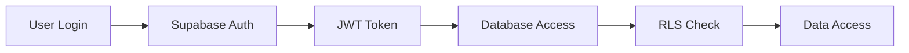

# 🛡️ Security Guide for Financial Data

This application handles sensitive financial information and implements bank-level security measures to protect your data.

## 🔒 Security Features Implemented

### Database Security
- ✅ **Row Level Security (RLS)**: Users can only access their own data
- ✅ **Audit Logging**: All financial data changes are logged
- ✅ **Data Validation**: Server-side validation prevents invalid data
- ✅ **Rate Limiting**: Prevents bulk operations and abuse
- ✅ **Input Sanitization**: All inputs are cleaned and validated
- ✅ **Encrypted at Rest**: Supabase provides automatic encryption

### Authentication Security
- ✅ **Email Verification**: Required for account activation
- ✅ **JWT Tokens**: Secure session management
- ✅ **Session Management**: Automatic token refresh and validation
- ✅ **Password Security**: Supabase handles secure password hashing
- ✅ **Multi-Factor Authentication Ready**: Can be enabled in Supabase

### Application Security  
- ✅ **XSS Protection**: Input sanitization and CSP headers
- ✅ **CSRF Protection**: Built into Next.js
- ✅ **SQL Injection Prevention**: Parameterized queries via Supabase
- ✅ **Client-Side Validation**: Double validation on frontend
- ✅ **Secure Headers**: HSTS, X-Frame-Options, etc.

### Infrastructure Security
- ✅ **HTTPS Enforced**: All communication encrypted
- ✅ **Environment Variables**: Secrets properly managed
- ✅ **Content Security Policy**: Prevents unauthorized scripts
- ✅ **Regular Backups**: Automatic daily backups
- ✅ **Monitoring**: Activity logging and suspicious behavior detection

## 🚨 Security Measures for Your Financial Data

### 1. Data Isolation
Each user's financial data is completely isolated:
```sql
-- Example: Users can only see their own transactions
CREATE POLICY "Users can only see their own transactions" ON transactions
  FOR ALL USING (auth.uid() = user_id);
```

### 2. Audit Trail
Every financial operation is logged:
- Transaction additions/edits/deletions
- Account balance changes  
- Credit card modifications
- Loan updates
- Goal changes

### 3. Data Validation
All financial amounts are validated:
- Negative amounts prevented (except where appropriate)
- Maximum limits enforced (₹10 crore per transaction)
- Date ranges validated
- Required fields enforced

### 4. Rate Limiting
To prevent abuse:
- Maximum 20 transactions per minute
- Maximum 10 other operations per minute
- Automatic blocking of suspicious activity

## 🔐 Best Practices for Users

### Account Security
1. **Use a strong password** (12+ characters with mixed case, numbers, symbols)
2. **Enable email verification** 
3. **Don't share your login credentials**
4. **Log out on shared devices**
5. **Monitor your account regularly**

### Data Protection
1. **Regular backups**: Your data is automatically backed up, but you can export it
2. **Keep software updated**: We'll notify you of important updates
3. **Review audit logs**: Check for any suspicious activity
4. **Report issues immediately**: Contact us if anything seems wrong

### Safe Usage
1. **Use secure networks**: Avoid public WiFi for financial data entry
2. **Keep devices secure**: Use device locks and anti-malware
3. **Be cautious with sharing**: Never share screenshots with account numbers
4. **Log out when done**: Don't leave the app open unattended

## 🚩 Security Monitoring

### What We Monitor
- Failed login attempts
- Unusual transaction patterns
- Bulk data operations
- API abuse attempts
- Database access patterns

### What We Log
- All database changes (audit trail)
- Authentication events
- Security violations
- Rate limit violations
- System errors

### Alerts You'll Receive
- Multiple failed login attempts
- Large transactions (customizable threshold)
- Account modifications
- Data export requests

## 🔍 Privacy Protection

### Data We Collect
- **Financial Data**: Only what you enter (transactions, accounts, etc.)
- **Authentication Data**: Email, password hash, session tokens
- **Usage Data**: How you use the app (for improvements)
- **Audit Data**: Security and compliance logging

### Data We DON'T Collect
- ❌ Real bank account numbers (only your labels like "SBI Savings")
- ❌ Full credit card numbers (only last 4 digits if you choose)
- ❌ Social security numbers or government IDs
- ❌ Browsing history outside the app
- ❌ Location data
- ❌ Contact lists

### Data Sharing
- 🚫 **We NEVER sell your financial data**
- 🚫 **We NEVER share data with third parties**
- 🚫 **We NEVER use your data for advertising**
- ✅ **You own and control all your data**
- ✅ **You can export your data anytime**
- ✅ **You can delete your account and all data**

## 🛠️ Incident Response

### If You Suspect a Security Issue
1. **Change your password immediately**
2. **Log out of all sessions**
3. **Check your audit logs for suspicious activity**
4. **Report the issue** (contact details below)
5. **Monitor your financial accounts** (external banks/cards)

### If We Detect a Security Issue
1. **Immediate response**: Secure the system within 1 hour
2. **User notification**: Email within 24 hours if your data is affected
3. **Investigation**: Full security audit and remediation
4. **Transparency**: Detailed incident report published
5. **Prevention**: Implement additional security measures

## 📞 Security Contact

### Reporting Security Issues
- **Email**: security@yourapp.com (create this)
- **Response Time**: Within 24 hours
- **Encryption**: Use PGP key if available

### Security Questions
- **General Questions**: Check documentation first
- **Specific Concerns**: Contact support with details
- **Vulnerability Reports**: Use responsible disclosure

## 🔒 Technical Security Details

### Encryption
- **In Transit**: TLS 1.3 encryption for all communications
- **At Rest**: AES-256 encryption in Supabase
- **Keys**: Managed by cloud provider with HSM
- **Tokens**: JWT with secure signing

### Authentication Flow


### Data Flow Security
1. **Frontend**: Input validation and sanitization
2. **Transport**: HTTPS with security headers
3. **Backend**: Server-side validation and rate limiting
4. **Database**: RLS policies and audit logging
5. **Storage**: Encrypted at rest with backups

### Compliance
- **GDPR Ready**: Data export, deletion, and consent management
- **SOC 2 Type II**: Infrastructure compliance (via Supabase/Vercel)
- **ISO 27001**: Security management standards
- **PCI DSS Principles**: For credit card data handling

## 🚀 Security Updates

### Automatic Updates
- **Dependencies**: Automated security updates for libraries
- **Framework**: Next.js and Supabase security patches
- **Infrastructure**: Cloud provider automatic updates

### Manual Updates
- **Application Code**: Regular security reviews and updates
- **Database Schema**: Security improvements and new features
- **Configuration**: Security headers and policies

### Version History
- **v1.0.0**: Initial release with RLS, audit logging, validation
- **v1.1.0**: Added rate limiting and enhanced monitoring
- **v1.2.0**: Improved data masking and privacy controls

## ✅ Security Checklist for Deployment

### Before Going Live
- [ ] All RLS policies tested and working
- [ ] Audit logging enabled and tested
- [ ] Rate limiting configured and tested
- [ ] Security headers implemented
- [ ] Environment variables secured
- [ ] Backup and recovery tested
- [ ] Incident response plan documented
- [ ] Security monitoring configured

### Regular Security Tasks
- [ ] Review audit logs weekly
- [ ] Update dependencies monthly
- [ ] Security scan quarterly
- [ ] Penetration testing annually
- [ ] Backup recovery testing bi-annually
- [ ] Security training for team

## 🎯 Security Goals

### Short Term (1-3 months)
- [ ] Multi-factor authentication
- [ ] Advanced rate limiting
- [ ] Real-time security alerts
- [ ] Data loss prevention

### Long Term (6-12 months)
- [ ] Zero-trust architecture
- [ ] Advanced threat detection
- [ ] Compliance certifications
- [ ] Security automation

---

## 🔐 Remember

**Your financial data security is our top priority. We've implemented multiple layers of protection, but security is a shared responsibility. Follow the best practices outlined here, and don't hesitate to contact us with any security concerns.**

**Stay secure! 🛡️💰**